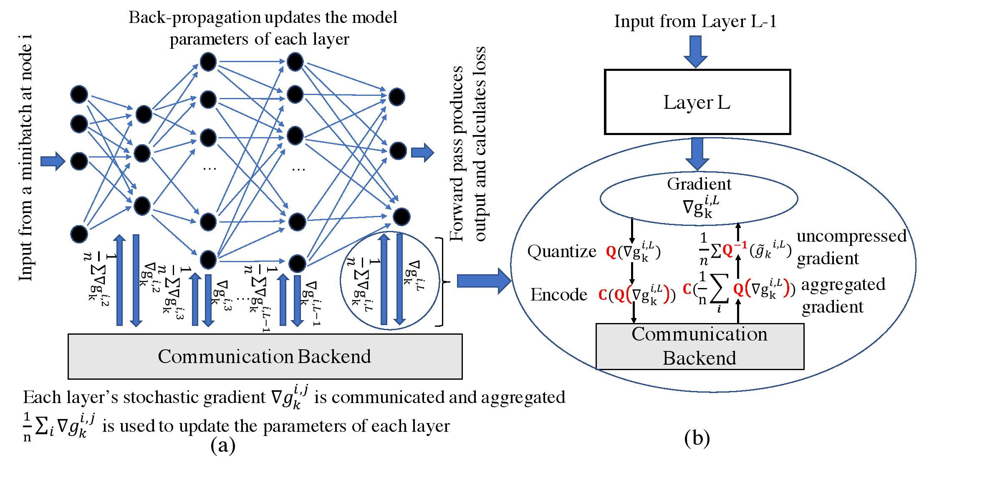

# Distributed_ML
This repository provides essential encoding techniques used in the work: "[Huffman Coding Based Encoding Techniques for Fast Distributed Deep Learning](https://dl.acm.org/doi/abs/10.1145/3426745.3431334)". 

Currently this repository consists of six encoding schemes:
1. Run Length Encoding
2. Normal Huffman Encoding
3. Elias Omega Encoding
4. **Sample Huffman** (Ours)
5. **Sample Huffman with Sparsity** (Ours)
6. **Run Length Huffman** (Ours)

## How it Works


* **(a)** Distributed DNN training from the perspective of i<sup>th</sup> node. **(b)** Compression, encoding, and decompression. This work focuses on providing efficient encoding operator `C(.)` for quantization operator `Q(.)`

Each encoding is  defined in a seperate class, and each class has a `compress` and a `decompress` member function. The `compress` function returns the encoded document and updates the Encoding class object with the encodings and reverses mapping of the encodings which would later help in decompression. The `decompress` function decodes the encoded document and returns the decoded document (in our case, the gradient vector).

The encoding schemes can be seen as an extended unit in  the `grace_dl/dist/compressor/` directory 
 of the [GRACE](https://github.com/sands-lab/grace/) github project  of [Sands-Lab](https://sands.kaust.edu.sa/) in KAUST.


## Usage
An ecoding scheme can be used using code of the following template:

* my_scheme = <Encoding_Scheme_Class>()
```
encoded_document = my_scheme.compress(qunatized_grads)
decoded_document = my_scheme.decompress
code_length_of_encoded_document = my_scheme.code_length
```

## Supported Frameworks
The encoding techniques are **NOT** dependent on any specific APIs or framework and can be run as independent python scripts. **They can be integrated into Horovod API**, OpenMPI, NVIDIA NCCL, and Facebook Gloo.

## Citation
If you use our codebase please cite our work:

“Huffman coding based encoding techniques for fast distributed deep learning,” Rishikesh R. Gajjala, Shashwat Banchhor, Ahmed M. Abdelmoniem, Aritra Dutta, Marco Canini, and Panos Kalnis. In Proceedings of ACM CoNEXT 1st Workshop on Distributed MachineLearning (DistributedML ’20), 2020.

Here's a BibTex:
``` 
@inproceedings{10.1145/3426745.3431334,
    author = {Gajjala, Rishikesh R. and Banchhor, Shashwat and Abdelmoniem, Ahmed M. and Dutta, Aritra and Canini, Marco and Kalnis, Panos},
    title = {Huffman Coding Based Encoding Techniques for Fast Distributed Deep Learning},
    year = {2020},
    isbn = {9781450381826},
    publisher = {Association for Computing Machinery},
    address = {New York, NY, USA},
    url = {https://doi.org/10.1145/3426745.3431334},
    doi = {10.1145/3426745.3431334},
    booktitle = {Proceedings of the 1st Workshop on Distributed Machine Learning},
    pages = {21–27},
    numpages = {7},
    keywords = {Elias and Run-length Encoding, Gradient compression, Huffman coding, Distributed training, Quantization},
    location = {Barcelona, Spain},
    series = {DistributedML'20}
}
```

## Questions
We welcome any questions or suggestions or comments. Please feel free to contact any of us. 
* [Aritra Dutta](mailto:aritra.dutta@kaust.edu.sa)
* [Rishikesh R. Gajjala](mailto:gsmrishi@gmail.com)
* [Shashwat Banchhor](mailto:shashwatbanchhor12@gmail.com)


